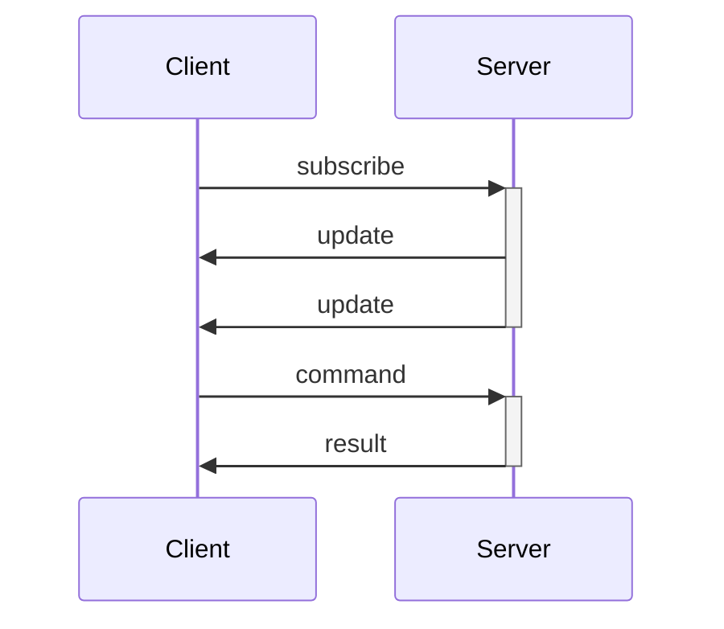

# Websocket API Specification

The core of EventRPC is a real-time, websocket based API specification which dictates how clients and servers should communicate.

## API flows

Two flows are distinguished, a command-response flow, and a subscriber flow. The first handles the process of issuing commands to an aggregate, and receiving feedback of processing, the latter is the process of receiving state updates and event hooks from the server.



## Websocket connection

The specifics of the websocket implementation are best left out of scope of the specification. Implementations should allow the user to provide a means of sending messages, authenticating and authorizing requests, programming languages generally have their own implementations of websockets, and these should be used.

## Data transmission

Specification uses JSON to transfer data payloads between systems, hence, implementations should be able to handle encoding and decoding of JSON in their host language.

## Message envelope

A general message envelope contains EventRPC specific data that is to be shared between clients and servers. This envelope contains:

-   `version` of the EventRPC specification that is supported used by the sender
-   `app-name` name of the service / client application that is sending the message
-   `app-id` id of the instance of the application that is sending the message
-   `timestamp` Unix epoch timestamp of the message sent
-   `correlation` the correlation ID is defined by a client message, and returned by the server
    -   this ID allows the client to correlate a `result` message with a command, and a `update` message with a subscription
    -   internally, it is useful to the implementation for tracking state and subscribers
-   `type` denotes the [type](##Messages) of the EventRPC message - _update_ sends a state update to the client, this can be an aggregate or a projection update
-   `meta` is an object that can contain any metadata required by middlewares and users
-   `payload` contains the data of the message

```JSON
{
    "version": "v0.0.1",
    "app-name": "app",
    "app-id": "12345",
    "timestamp": 1736709027,
    "correlation-id": "54321",
    "type": "command" | "subscribe" | "result" | "update",
    "meta": {...},
    "payload": {...},
}
```

## IDs

The implementations are expected to understand various `string` type IDs.

-   `app-id` is a signifier of an instance of a client or server, used for observability
-   `correlation-id` is an ID used to correlate requests and responses within the websocket connection, this is manly an EventRPC internal ID
-   `aggregate-id` an aggregate ID represents an individually identified aggregate, the source of this ID will mostly be the server side event sourcing library, and not the EventRPC implementation itself
-   `aggregate-name` is a name of the aggregate, that comes from the event sourcing library and the user
-   `projection-id` like the aggregate ID, the projection ID identifies a projection and comes from the event sourcing libraries
-   `projection-name` is a name of the projection, that comes from the event sourcing library and the user
-   `event-id` an ID of an individual event
-   `event-name` a type of event that clients can subscribe to, this will be defined by the user of an event sourcing library
-   `command-name` a type of command that clients can issue to an aggregate, this will be defined by the user of an event sourcing library

## Messages

The API consists of 4 main message types, 2 client side, and 2 server side.

### Client sent messages

A EventRPC client is expected to be able to produce `subscribe` and `command` messages.

The `subscribe` message is sent to trigger a stream of updates from the server in regards to an entity. An entity can be one of _aggregate_, _projection_ or _event_. Following this message, the client can expect a stream of `update` messages from the server.

-   `to`, required - specifies the entity type that a client is subscribing to
-   `id`, required - a `aggregate-id`, `projection-id` depending on the type of subscription
    -   In case of an `event` subscription, a valid `aggregate-id` is expected, the client will receive all published events from a given aggregate, unless an `event-name` is defined
-   `event-name`, only with `to` == **event** - specifies the event type that the client wants to receive

```JSON
{
    ...,
    "payload": {
        "to": "event" | "aggregate" | "projection",
        "id": "123456",
        "event-name": "test",
    }
}
```

The `command` message issues a command to an aggregate on the server. The server is expected to reply with a `result` that contains the same correlation id as the command that triggered it. Since commands are meant to result in events within event sourced aggregates, in case the client is also subscribed to state or events of an aggregate that it is commanding, the client can expect to also receive `update` message following the command execution.

-   `id`, required - a `aggregate-id`, `projection-id` or `event-id` depending on the type of `update` message
-   `type`, required - is a `command-name` identification of an aggregate command
-   `data`, required - contains data for the given command

```JSON
{
    ...,
    "payload": {
        "id": "b53k234",
        "type": "add..",
        "data": {...}
    }
}
```

### Server sent messages

A server is expected to send `result` and `update` messages.

The `result` message should always be sent in response to a `command` message after the command is processed by an aggregate. It consists of simple status data, and it **does not** communicate state changes or event data in any way.

-   `status`, required - defines the result of the command processing
    -   **ok** is self-explanatory
    -   **failed** signifies that a command failed to be processed by an aggregate an equivalent to a 5xx range HTTP error
    -   **rejected** signifies that a command payload is bad or some other middleware rejected the command and did not pass it to the aggregate an equivalent to a 4xx range HTTP error
-   `errors` - an array of string errors that can be returned describing errors that occurred

```JSON
{
    ...,
    "payload": {
        "status": "ok" | "failed" | "rejected",
        "errors": ["some"],
    }
}
```

The `update` message should be sent out on every aggregate, and projection state change, when there is a subscriber to these particular states. The messages sent should contain a correlation id respective of the subscribers `subscribe` message.

-   `type`, required - time of the state change
-   `version`, required - version of the aggregate, or projection that is represented in the data
    -   in case of an event `update` message, it should be the **aggregate version**
-   `id`, required - a `aggregate-id`, `projection-id` or `event-id` depending on the type of `update` message
-   `name`, required - a `aggregate-name`, `projection-name` or `event-name` depending on the type of `update` message
-   `data`, required - contains state or event data

```JSON
{
    ...,
    "payload": {
        "timestamp": 1736709027,
        "version": 2,
        "id": 2,
        "name": "orders-report",
        "data": {...},
    }
}
```
